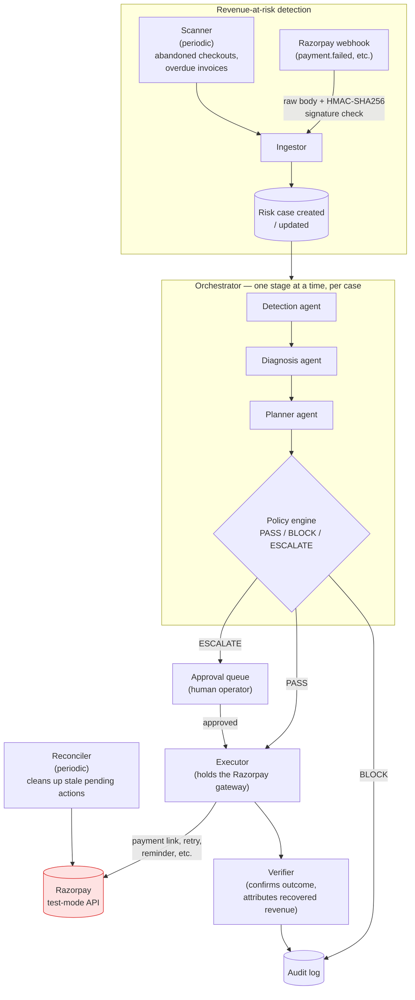
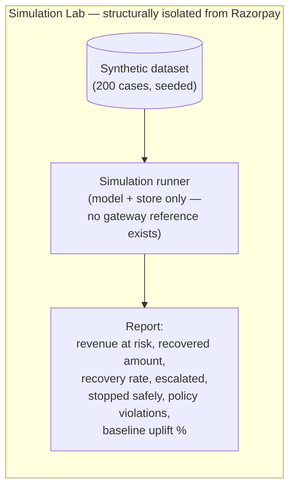

# Architecture

LEDGERFLOW runs as a single Go binary (`backend/cmd/server`) plus a Next.js
operator console (`frontend`). The backend owns every stage of the recovery
loop; the frontend only ever talks to it through one proxied API path.

## Recovery pipeline

## Why it's structured this way

- **The executor is the only component holding a Razorpay client.** The
  detection/diagnosis/planner agents, the orchestrator, and the simulation
  runner never receive one. A simulated run can't accidentally call the real
  gateway,  there's no object in its call graph capable of it, so this holds
  by construction rather than by a runtime flag anyone could flip.
- **The verifier is the sole settler.** A webhook can create or update a case,
  but only the verifier attributes a confirmed payment as recovered revenue -
  so no single inbound event can directly write a revenue total.
- **The policy engine gates every action before execution**, not after.
  `PASS` proceeds to the executor automatically (when `AUTO_EXECUTE_APPROVED`
  is on); `ESCALATE` always waits for a human regardless of that setting;
  `BLOCK` goes straight to the audit log with no execution attempt.
- **Every agent has a deterministic fallback.** If `GEMINI_API_KEY` is unset,
  detection/diagnosis/planning fall back to rule-based logic instead of
  failing - the system runs the same pipeline either way, and which path
  produced a given decision is logged and shown in the UI.
- **One process, not a microservice fleet.** The components above are already
  separate Go packages with narrow interfaces between them (`agents`,
  `orchestrator`, `policy`, `executor`, `events`, `verify`, `store`), so
  splitting them into separate services later is a deployment change, not a
  rewrite.

## Request path (frontend ↔ backend)

The browser never holds a Razorpay or Gemini credential and never calls the
Go API directly. Every request goes through `frontend/src/app/api/proxy`,
a server-side Next.js route that attaches the session's JWT and forwards to
`LEDGERFLOW_API_URL`. This keeps every secret server-side and out of the
browser bundle (see `frontend/.env.example` for the reasoning).

## Where things live

| Concern | Package |
| --- | --- |
| HTTP handlers, auth middleware | `backend/internal/httpapi` |
| Webhook ingestion, idempotency | `backend/internal/events` |
| Detection / diagnosis / planning agents | `backend/internal/agents` |
| Pipeline sequencing per case | `backend/internal/orchestrator` |
| PASS / BLOCK / ESCALATE rules | `backend/internal/policy` |
| Executing recovery actions | `backend/internal/executor` |
| Confirming outcomes, attributing revenue | `backend/internal/verify` |
| Razorpay client (real + sandbox) | `backend/internal/razorpay` |
| Benchmark dataset, batch runner, report | `backend/internal/simulation` |
| Persistence, migrations | `backend/internal/store` |
